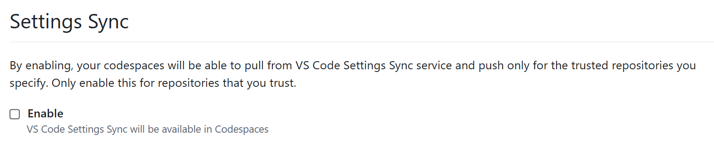

# Setting Up Settings Sync for GitHub Codespaces

1. **Access Settings Sync**:
   - In your Codespace, click on the gear icon (⚙️) in the lower-left corner of VS Code
   - Select "Turn on Settings Sync..."

2. **Choose What to Sync**:
   - A dialog will appear allowing you to select what to synchronize
   - Recommended: Select all options for a fully consistent experience
     - Settings
     - Keyboard Shortcuts
     - Extensions
     - User Snippets
     - UI State

3. **Sign in to GitHub**:
   - When prompted, authenticate with your GitHub account
   - This will connect Settings Sync to your GitHub account

4. **Verify Synchronization**:
   - Look for the Settings Sync icon in the bottom-left corner of VS Code
   - A check mark (✓) indicates that sync is active and working
   - Or more fun: Change the color theme into something pretty and open a new codespace to see if it is applied automatically

### Turn off Settings Sync
1. Go to [Github.com/settings](https://github.com/settings/codespaces)
2. Uncheck: 
#